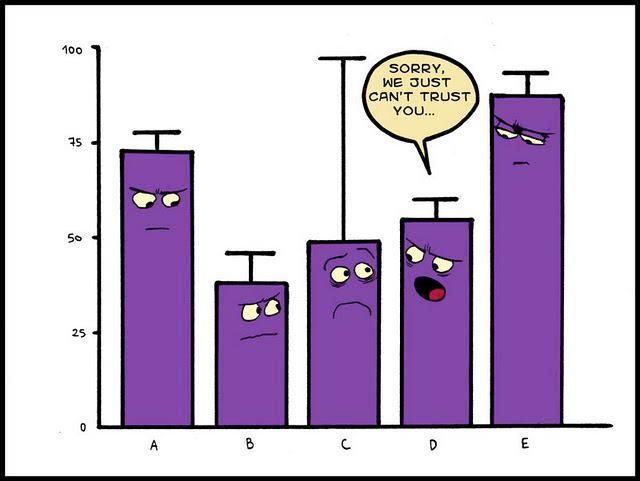

```{r, include=FALSE}
library(tidyverse)
```


## 1. Байесовский вывод

### 1.1 Нотация

В байесовском подоходе статистический вывод описывается формулой Байеса

$$P(θ|Data) = \frac{P(Data|θ)\times P(θ)}{P(Data)}$$

* $P(θ|Data)$ --- апостериорная вероятность (posterior)
* $P(Data|θ)$ --- функция правдоподобия (likelihood)
* $P(θ)$ ---  априорная вероятность (prior)
* $P(Data)$ --- нормализующий делитель

В литературе можно еще встретить такую запись:

$$P(θ|Data) \propto P(Data|θ)\times P(θ)$$

## 2. Биномиальные данные

Биномиальные данные возникают, когда нас интересует доля успехов в какой-то серии эксперементов Бернулли.

### 2.1  Биномиальное распределение

Биномиальное распределение --- распределение количества успехов эксперементов Бернулли из *n* попыток с вероятностью успеха *p*.

$$P(k | n, p) = \frac{n!}{k!(n-k)!} \times p^k \times (1-p)^{n-k} =  {n \choose k} \times p^k \times (1-p)^{n-k}$$ 
$$ 0 \leq p \leq 1; n, k > 0$$

```{r}
data_frame(x = 0:50,
           density = dbinom(x = x, size = 50, prob = 0.16)) %>% 
  ggplot(aes(x, density))+
  geom_point()+
  geom_line()+
  labs(title = "Биномиальное распределение p = 0.16, n = 50")
```

### 2.2 Бета распределение

$$P(x; α, β) = \frac{x^{α-1}\times (1-x)^{β-1}}{B(α, β)}; 0 \leq x \leq 1; α, β > 0$$

Бета функция:

$$Β(α, β) = \frac{Γ(α)\times Γ(β)}{Γ(α+β)} = \frac{(α-1)!(β-1)!}{(α+β-1)!} $$


```{r}
data_frame(x = seq(0, 1, length.out = 100),
           density = dbeta(x = x, shape1 = 8, shape2 = 42)) %>% 
  ggplot(aes(x, density))+
  geom_point()+
  geom_line()+
  labs(title = "Бета распределение α = 8, β = 42")
```

Можно поиграть с разными параметрами:

```{r, eval = FALSE}
shiny::runGitHub("agricolamz/beta_distribution_shiny") 
```

$$\mu = \frac{\alpha}{\alpha+\beta}$$

$$\sigma^2 = \frac{\alpha\times\beta}{(\alpha+\beta)^2\times(\alpha+\beta+1)}$$


### 2.3 Байесовский апдейт биномиальных данных

$$Beta_{post}(\alpha_{post}, \beta_{post}) = Beta(\alpha_{prior}+\alpha_{data}, \beta_{prior}+\beta_{data}),$$
где $Beta$ --- это бета распределение

```{r, eval = FALSE}
shiny::runGitHub("agricolamz/bayes_for_binomial_app") 
```


### 2.4 Байесовский апдейт биномиальных данных: несколько моделей

```{r}
data_frame(x = rep(seq(0, 1, length.out = 100), 6),
           density = c(dbeta(unique(x), shape1 = 8, shape2 = 42),
                       dbeta(unique(x), shape1 = 16, shape2 = 34),
                       dbeta(unique(x), shape1 = 24, shape2 = 26),
                       dbeta(unique(x), shape1 = 8+4, shape2 = 42+16),
                       dbeta(unique(x), shape1 = 16+4, shape2 = 34+16),
                       dbeta(unique(x), shape1 = 24+4, shape2 = 26+16)),
           type = rep(c("prior", "prior", "prior", "posterior", "posterior", "posterior"), each = 100),
           dataset = rep(c("prior: 8, 42", "prior: 16, 34", "prior: 24, 26",
                           "prior: 8, 42", "prior: 16, 34", "prior: 24, 26"), each = 100)) %>% 
  ggplot(aes(x, density, color = type))+
  geom_line()+
  facet_wrap(~dataset)+
  labs(title = "data = 4, 16")
```


### 2.5
В базе данных [Phoible](http://phoible.org/), в которой собраны фонологические инвентари в языках мира. В [датасет](https://raw.githubusercontent.com/agricolamz/2019_BayesDan_winter/master/datasets/phoible_n_consonants.csv) записано три переменных:

* language --- язык;
* consonants --- количество согласных;
* phonemes --- количество фонем.

Посчитайте долю, которую составляет согласные от всего фонологического набора каждого языка и укажите название языка, в котором эта доля максимальна.

```{r, include=FALSE}
df <- read_csv("https://raw.githubusercontent.com/agricolamz/2019_BayesDan_winter/master/datasets/phoible_n_consonants.csv")
df %>% 
  mutate(ratio = consonants/phonemes) ->
  df

df %>% 
  filter(ratio == max(ratio)) %>% 
  select(language)
```

<form name="FormOne" onsubmit="return validateFormOne()" method="post">
<input type="text" name="answerOne">
<input type="submit" value="check">
</form><br>

Проведите байесовский апдейт наблюдений каждого языка, используя в качестве априорного распределения бета распределение с параметрами α = 9.300246, и β = 4.4545. Посчитайте модуль разницы между апостериорной и изначальной долями согласных,  представленных в данных. В ответе укажите язык с наибольшей разницей.

```{r, include=FALSE}
alpha0 <- 9.300246
beta0 <- 4.4545

df %>% 
  mutate(alpha = consonants + alpha0,
         beta = phonemes - consonants + beta0,
         posterior_mean = alpha/(alpha+beta),
         diff = abs(posterior_mean - ratio)) %>% 
  arrange(desc(diff)) %>% 
  select(language)
```

<form name="FormTwo" onsubmit="return validateFormTwo()" method="post">
<input type="text" name="answerTwo">
<input type="submit" value="check">
</form><br>

## 3 Байесовский доверительный интервал

Когда мы получаем оценку какого-то параметра, всегда имеет смысл иметь какую-то меру, которая бы показывала, на сколько мы верим тому или иному значению.



### 1.1 Данные

* количество "не" в 311 рассказов А. Чехова
* число слов в каждом рассказе

```{r}
chekhov <- read_csv("https://raw.githubusercontent.com/agricolamz/2019_BayesDan_winter/master/datasets/chekhov.csv")

chekhov %>% 
  mutate(trunc_titles = str_trunc(titles, 25, side = "right"),
         average = n/n_words) ->
  chekhov
```

### 2.1 Симметричный интервал (equal-tailed interval): медиана и квантили
Байесовский доверительный $k$-% интервал (по-английски credible interval) --- это интервал $[\frac{k}{2}, 1-\frac{k}{2}]$ от апостериорного распределения. Давайте проапдейтим данные рассказов Чехова при помощи априорного распределения с параметрами ($\alpha = 5.283022$, $\beta = 231.6328$), а дальше можем использовать функцию `qbeta()`, чтобы получить интервал, в котором находятся центральные $k$%.

```{r, fig.height=7}
chekhov %>% 
  slice(1:30) %>%
  group_by(trunc_titles) %>% 
  mutate(beta_prior = n_words-n,
         alpha_post = n + 5.283022,
         beta_post = beta_prior + 231.6328,
         median_post = qbeta(.5, alpha_post, beta_post),
         eq_t_int_l = qbeta(.025, alpha_post, beta_post),
         eq_t_int_h = qbeta(.975, alpha_post, beta_post),
         low_ci = mosaic::binom.test(x = n, n = n_words)$conf.int[1],
         up_ci = mosaic::binom.test(x = n, n = n_words)$conf.int[2]) %>% 
  ggplot(aes(x= trunc_titles))+
  geom_pointrange(aes(y = average, ymin = low_ci, ymax = up_ci), color = "royalblue")+
  geom_pointrange(aes(y = median_post, ymin = eq_t_int_l, ymax = eq_t_int_h), color = "tomato", position = position_nudge(x = -0.35))+
  coord_flip()+
  labs(title = 'Доверительные интервалы употребления "не" в рассказах А. Чехова',
       x = "", y = "",
       caption = "красные --- фриквентистский; синий --- байесовский eq-t")
```

### 2.2 Интервал максимальной (апостериорной) плотности (Highest (posterior) density interval): мода и HDI

```{r, fig.height=11}
library(HDInterval)
chekhov %>% 
  slice(1:30) %>%
  group_by(trunc_titles) %>% 
  mutate(beta_prior = n_words-n,
         alpha_post = n + 5.283022,
         beta_post = beta_prior + 231.6328,
         median_post = qbeta(.5, alpha_post, beta_post),
         moda_post = (alpha_post-1)/(alpha_post+beta_post-2),
         hdi_int_l = hdi(qbeta, shape1 = alpha_post, shape2 = beta_post, credMass = 0.95)[1],
         hdi_int_h = hdi(qbeta, shape1 = alpha_post, shape2 = beta_post, credMass = 0.95)[2],
         eq_t_int_l = qbeta(.025, alpha_post, beta_post),
         eq_t_int_h = qbeta(.975, alpha_post, beta_post),
         low_ci = mosaic::binom.test(x = n, n = n_words)$conf.int[1],
         up_ci = mosaic::binom.test(x = n, n = n_words)$conf.int[2]) %>% 
  ggplot(aes(x= trunc_titles))+
  geom_pointrange(aes(y = average, ymin = low_ci, ymax = up_ci), color = "royalblue", position = position_nudge(x = 0.25))+
  geom_pointrange(aes(y = median_post, ymin = eq_t_int_l, ymax = eq_t_int_h), color = "tomato")+
  geom_pointrange(aes(y = moda_post, ymin = hdi_int_l, ymax = hdi_int_h), color = "palegreen3", position = position_nudge(x = -0.25))+
  coord_flip()+
  labs(title = 'Доверительные интервалы употребления "не" в рассказах А. Чехова',
       x = "", y = "",
       caption = "красные --- фриквентистский; синий --- байесовский eq-t; зеленый --- байсовский hdi")
```

В качестве аргумента в пользу HDI всегда приводят вот такое распределение:


Биномиальные распределения не может иметь такого вида.

### 2.4
В базе данных [Phoible](http://phoible.org/), в которой собраны фонологические инвентари в языках мира. В [датасет](https://raw.githubusercontent.com/agricolamz/2019_BayesDan_winter/master/datasets/phoible_n_consonants.csv) записано три переменных:

* language --- язык;
* consonants --- количество согласных;
* phonemes --- количество фонем.

Посчитайте медиану и 80% симметричный интервал, которую составляет согласные от всего фонологического набора каждого языка, используя априорное бета распределение с параметрами α = 9.300246 и β = 4.4545. В ответе укажите язык, у которого интервал равен 0.083.

```{r, include=FALSE}
phoible <- read_csv("https://raw.githubusercontent.com/agricolamz/2019_BayesDan_winter/master/datasets/phoible_n_consonants.csv") 

phoible %>% 
  mutate(beta_prior = phonemes-consonants,
         alpha_post = consonants + 9.300246,
         beta_post = beta_prior + 4.4545,
         median_post = qbeta(.5, alpha_post, beta_post),
         eq_t_int_l = qbeta(.1, alpha_post, beta_post),
         eq_t_int_h = qbeta(.9, alpha_post, beta_post),
         interval = round(eq_t_int_h - eq_t_int_l, 3)) %>% 
  filter(interval == 0.083)
```

<form name="FormThree" onsubmit="return validateFormThree()" method="post">
<input type="text" name="answerThree">
<input type="submit" value="check">
</form><br>

### 2.5
В базе данных [Phoible](http://phoible.org/), в которой собраны фонологические инвентари в языках мира. В [датасет](https://raw.githubusercontent.com/agricolamz/2019_BayesDan_winter/master/datasets/phoible_n_consonants.csv) записано три переменных:

* language --- язык;
* consonants --- количество согласных;
* phonemes --- количество фонем.

Посчитайте моду и 80% интервал максимальной апостериорной плотности, которую составляет согласные от всего фонологического набора каждого языка, используя априорное бета распределение с параметрами α = 9.300246 и β = 4.4545. В ответе укажите язык, у которого интервал равен 0.091.

```{r, eval=FALSE}
phoible <- read_csv("https://raw.githubusercontent.com/agricolamz/2019_BayesDan_winter/master/datasets/phoible_n_consonants.csv") 

phoible %>%
  group_by(language) %>% 
  rowwise() %>% # это нужно, так как авторы HDInterval не векторизовали hdi
  mutate(...) %>% 
```


```{r, include=FALSE}
phoible <- read_csv("https://raw.githubusercontent.com/agricolamz/2019_BayesDan_winter/master/datasets/phoible_n_consonants.csv") 

phoible %>%
  group_by(language) %>% 
  rowwise() %>% # это нужно, так как авторы HDInterval не векторизовали hdi
  mutate(beta_prior = phonemes-consonants,
         alpha_post = consonants + 9.300246,
         beta_post = beta_prior + 4.4545,
         moda_post = (alpha_post-1)/(alpha_post+beta_post-2),
         hdi_int_l = hdi(qbeta, shape1 = alpha_post, shape2 = beta_post, credMass = 0.8)[1],
         hdi_int_h = hdi(qbeta, shape1 = alpha_post, shape2 = beta_post, credMass = 0.8)[2],
         interval = round(hdi_int_h - hdi_int_l, 3)) %>% 
  filter(interval == 0.091)
```

<form name="FormFour" onsubmit="return validateFormFour()" method="post">
<input type="text" name="answerFour">
<input type="submit" value="check">
</form><br>


## 3. Вопросы к апостериорному распределению

1) попытка оценить параметр θ и какой-нибудь интервал, в котором он лежит (см. предыдущий раздел).
2) ответить на вопросы вроде
    * какая вероятность что значение θ больше некоторого значения $x$?
    * какая вероятность что значение θ лежит в интервале $[x; y]$?
    * и т. п.
    
<script>
function validateFormOne() {
    var x = document.forms["FormOne"]["answerOne"].value;
    if (x != "5.87") {
        alert("У меня другой ответ...");
        return false;
    } else {
        alert("Да, все правильно");
        return false;
    }
}
function validateFormTwo() {
    var x = document.forms["FormTwo"]["answerTwo"].value;
    if (x != "Namia") {
        alert("У меня другой ответ...");
        return false;
    } else {
        alert("Да, все правильно");
        return false;
    }
}
function validateFormThree() {
    var x = document.forms["FormThree"]["answerThree"].value;
    if (x != "Karaja") {
        alert("У меня другой ответ...");
        return false;
    } else {
        alert("Да, все правильно");
        return false;
    }
}
function validateFormFour() {
    var x = document.forms["FormFour"]["answerFour"].value;
    if (x != "0.5317367") {
        alert("У меня другой ответ... в нем 7 знаков после запятой");
        return false;
    } else {
        alert("Да, все правильно");
        return false;
    }
}
</script>
