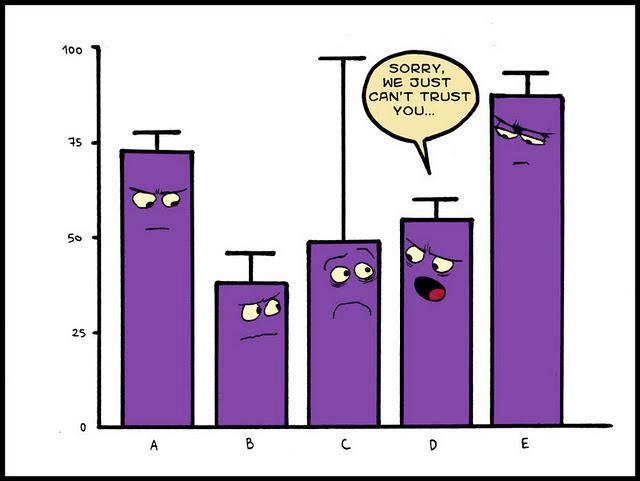

```{r, message=FALSE}
library(tidyverse)
theme_set(theme_bw())
```


## 1. Байесовский вывод

### 1.1 Нотация

В байесовском подоходе статистический вывод описывается формулой Байеса

$$P(θ|Data) = \frac{P(Data|θ)\times P(θ)}{P(Data)}$$

* $P(θ|Data)$ --- апостериорная вероятность (posterior)
* $P(Data|θ)$ --- функция правдоподобия (likelihood)
* $P(θ)$ ---  априорная вероятность (prior)
* $P(Data)$ --- нормализующий делитель

В литературе можно еще встретить такую запись:

$$P(θ|Data) \propto P(Data|θ)\times P(θ)$$

### 1.2 Бета-распределение

$$P(x; α, β) = \frac{x^{α-1}\times (1-x)^{β-1}}{B(α, β)}; 0 \leq x \leq 1; α, β > 0$$

Бета функция:

$$Β(α, β) = \frac{Γ(α)\times Γ(β)}{Γ(α+β)} = \frac{(α-1)!(β-1)!}{(α+β-1)!} $$


```{r}
data_frame(x = seq(0, 1, length.out = 100),
           density = dbeta(x = x, shape1 = 8, shape2 = 42)) %>% 
  ggplot(aes(x, density))+
  geom_point()+
  geom_line()+
  labs(title = "Бета распределение α = 8, β = 42")
```

Можно поиграть с разными параметрами:

```{r, eval = FALSE}
shiny::runGitHub("agricolamz/beta_distribution_shiny") 
```

$$\mu = \frac{\alpha}{\alpha+\beta}$$

$$\sigma^2 = \frac{\alpha\times\beta}{(\alpha+\beta)^2\times(\alpha+\beta+1)}$$

$$mode = \frac{\alpha-1}{\alpha+\beta-2}$$

### 1.3 Данные

* количество "не" в 311 рассказов А. Чехова
* число слов в каждом рассказе

```{r}
chekhov <- read_csv("https://raw.githubusercontent.com/agricolamz/2019_FE_R_statistics/master/data/chekhov.csv")

chekhov %>% 
  mutate(trunc_titles = str_trunc(titles, 25, side = "right"),
         average = n/n_words) ->
  chekhov
```

## 2. Байесовский доверительный интервал

Какие вопросы к апостериорному распределению можно задать?

1) попытка оценить параметр θ и какой-нибудь интервал, в котором он лежит.
2) ответить на вопросы вроде
    * какая вероятность что значение θ больше некоторого значения $x$?
    * какая вероятность что значение θ лежит в интервале $[x; y]$?
    * и т. п.



### 2.1 Симметричный интервал (equal-tailed interval): медиана и квантили
Байесовский доверительный $k$-% интервал (по-английски credible interval) --- это интервал $[\frac{k}{2}, 1-\frac{k}{2}]$ от апостериорного распределения. Давайте проапдейтим данные рассказов Чехова при помощи априорного распределения с параметрами ($\alpha = 5.283022$, $\beta = 231.6328$), а дальше можем использовать функцию `qbeta()`, чтобы получить интервал, в котором находятся центральные $k$%.

```{r, fig.height=7}
chekhov %>% 
  slice(1:30) %>%
  group_by(trunc_titles) %>% 
  mutate(beta_prior = n_words-n,
         alpha_post = n + 5.283022,
         beta_post = beta_prior + 231.6328,
         median_post = qbeta(0.5, alpha_post, beta_post),
         eq_t_int_min = qbeta(0.025, alpha_post, beta_post),
         eq_t_int_max = qbeta(0.975, alpha_post, beta_post)) %>% 
  ggplot(aes(x= trunc_titles))+
  geom_pointrange(aes(y = median_post, ymin = eq_t_int_min, ymax = eq_t_int_max), color = "tomato")+
  coord_flip()+
  labs(title = 'Доверительные интервалы употребления "не" в рассказах А. Чехова',
       x = "", y = "",
       caption = "байесовский симметричный доверительный интервал")
```

### 2.2 Интервал максимальной (апостериорной) плотности (Highest (posterior) density interval): мода и HDI

```{r, fig.height=11}
chekhov %>% 
  slice(1:30) %>%
  group_by(trunc_titles) %>% 
  mutate(beta_prior = n_words-n,
         alpha_post = n + 5.283022,
         beta_post = beta_prior + 231.6328,
         median_post = qbeta(.5, alpha_post, beta_post),
         moda_post = (alpha_post-1)/(alpha_post+beta_post-2),
         hdi_int_min = HDInterval::hdi(qbeta, shape1 = alpha_post, shape2 = beta_post, credMass = 0.95)[1],
         hdi_int_max = HDInterval::hdi(qbeta, shape1 = alpha_post, shape2 = beta_post, credMass = 0.95)[2],
         eq_t_int_min = qbeta(.025, alpha_post, beta_post),
         eq_t_int_max = qbeta(.975, alpha_post, beta_post)) %>% 
  ggplot(aes(x= trunc_titles))+
  geom_pointrange(aes(y = median_post, ymin = eq_t_int_min, ymax = eq_t_int_max), color = "tomato")+
  geom_pointrange(aes(y = moda_post, ymin = hdi_int_min, ymax = hdi_int_max), color = "palegreen3", position = position_nudge(x = -0.3))+
  coord_flip()+
  labs(title = 'Доверительные интервалы употребления "не" в рассказах А. Чехова',
       x = "", y = "",
       caption = "красные — байесовский симметричный доверительный интервал;\n зеленый — байесовский интервал максимальной плотности")
```

В качестве аргумента в пользу HDI всегда приводят вот такое распределение:


### 2.3 

Посчитайте 80% байесовский симметричный интервал от бета-распределения с параметрами 43 и 57. Ответ приведите с точностью до 3 знаков после запятой.

Минимальное значение:

<form name="FormOne" onsubmit="return validateFormOne()" method="post">
<input type="text" name="answerOne">
<input type="submit" value="check">
</form><br>

Максимальное значение:

<form name="FormTwo" onsubmit="return validateFormTwo()" method="post">
<input type="text" name="answerTwo">
<input type="submit" value="check">
</form><br>

Посчитайте 80% байесовский интервал максимальной (апостериорной) плотности от бета-распределения с параметрами  43 и 57. Ответ приведите с точностью до 3 знаков после запятой.

Минимальное значение:

<form name="FormThree" onsubmit="return validateFormThree()" method="post">
<input type="text" name="answerThree">
<input type="submit" value="check">
</form><br>

Максимальное значение:

<form name="FormFour" onsubmit="return validateFormFour()" method="post">
<input type="text" name="answerFour">
<input type="submit" value="check">
</form><br>


## 3. Байесовский биномиальный тест

Представим старую задачу, когда у нас есть монетка с равновероятными, как мы полагаем, исходами, и мы пытаемся оценить насколько она соответствует нашим ожиданиям, если из 15 подкидываний 11 --- решка.

Мы воспользуемся двумя возможными априорными распределениями:

* неинформативным априорным распределением

```{r}
data_frame(x = seq(0, 1, length.out = 1000),
           density = dbeta(x = x, shape1 = 1, shape2 = 1)) %>% 
  ggplot(aes(x, density))+
  geom_line()+
  labs(title = "Бета распределение α = 1, β = 1")
```


* распределением Джефри

```{r}
data_frame(x = seq(0, 1, length.out = 1000),
           density = dbeta(x = x, shape1 = 0.5, shape2 = 0.5)) %>% 
  ggplot(aes(x, density))+
  geom_line()+
  labs(title = "Бета распределение α = 0.5, β = 0.5")
```

Произведем байесовский апдейт неинформативного априорного распределения:
```{r}
n_observation <- 15
a_post <-  1+11
b_post <- 1+4

data_frame(stats = c("mean", "sd", "80% credible interval min", "80% credible interval max"),
           values =  c(a_post/sum(a_post, b_post),
                       a_post*b_post/((a_post+b_post)^2*(a_post+b_post+1)),
                       qbeta(.1, shape1 = a_post, shape2 = b_post),
                       qbeta(.9, shape1 = a_post, shape2 = b_post)),
           x_pred = values*n_observation)

data_frame(x = seq(0, 1, length.out = n_observation),
           density = dbeta(x = x, shape1 = a_post, shape2 = b_post),
           eq_t_int_min = qbeta(.1, shape1 = a_post, shape2 = b_post)*n_observation,
           eq_t_int_max = qbeta(.9, shape1 = a_post, shape2 = b_post)*n_observation) %>% 
  ggplot(aes(1:n_observation, density))+
  geom_point()+
  geom_line()+
  geom_rect(aes(xmin = eq_t_int_min, xmax = eq_t_int_max, ymin = 0, ymax = 0.1))+
  labs(title = "Априорное бета распределение α = 1, β = 1",
       y = "density",
       x = "")

## The relative frequency of success is more than 0.5 by a probability of ...
pbeta(0.5, shape1 = a_post, shape2 = b_post)
## and less than 0.5 by a probability of ...
1 - pbeta(0.5, shape1 = a_post, shape2 = b_post)
```


### 3.1
Теперь давайте произведем байесовский апдейт распределения Джефри.

Введите получившееся среднее апостериорного распределения:
<form name="FormFive" onsubmit="return validateFormFive()" method="post">
<input type="text" name="answerFive">
<input type="submit" value="check">
</form><br>
Введите получившееся стандартное отклонение апостериорного распределения:
<form name="FormSix" onsubmit="return validateFormSix()" method="post">
<input type="text" name="answerSix">
<input type="submit" value="check">
</form><br>
Введите получившуюся нижнюю границу 80% байесовский симметричный интервал:
<form name="FormSeven" onsubmit="return validateFormSeven()" method="post">
<input type="text" name="answerSeven">
<input type="submit" value="check">
</form><br>
Введите получившуюся верхнюю границу 80% байесовский симметричный интервал:
<form name="FormEight" onsubmit="return validateFormEight()" method="post">
<input type="text" name="answerEight">
<input type="submit" value="check">
</form><br>
Введите ввероятность частоту успехов меньше 0.5:
<form name="FormNine" onsubmit="return validateFormNine()" method="post">
<input type="text" name="answerNine">
<input type="submit" value="check">
</form><br>
Введите ввероятность частоту успехов больше 0.5:
<form name="FormTen" onsubmit="return validateFormTen()" method="post">
<input type="text" name="answerTen">
<input type="submit" value="check">
</form><br>

## 4. Байесовский фактор

### 4.1 Данные

В зиловском диалекте андийского языка существует два класса для неодушевленных предметов. В 2017 году был проведен эксперимент, чтобы проверить, наличие вариативности в отнесению к тому или иному классу заимствованой и исконной лексики.

```{r}
zilo_classes <- read_csv("https://raw.githubusercontent.com/agricolamz/2019_FE_R_statistics/master/data/zilo.csv")
head(zilo_classes)
```

Переменные в датасете:

* s_id — код испытуемого
* age_2017 — возраст на 2017 год
* w_id — код стимула
* stimulus
* translation_en
* translation_ru
* stimulus_source — тип слова: исконное или заимствованное
* class — класс слова, к которому испытуемый отнес слово

### 4.2 Еще понадобиться вот эта функция для унимодального распределения:

```{r}
dunifbinom <- function(x, N, lo, hi) {
  y = x
  for (i in 1:length(x)) {
    y[i] = integrate(function(theta) dunif(theta, lo, hi) * dbinom(x[i], N, theta),
                     0, 1, subdivisions = 10000L,
                     rel.tol = 1e-4, 
                     abs.tol = 1e-4,
                     stop.on.error = TRUE,
                     keep.xy = FALSE, 
                     aux = NULL)$value
  }
  y
}
```

### 4.3 Гипотезы

* For each word we have three variants:
    * *b*-class
    * *r*-class
    * variability

* So we can represent our idea with three **point hypotheses**:
    * *b*-class --- 1
    * *r*-class --- 0
    * variability --- 0.5
    
### 4.4 Точечные гипотезы

```{r}
x_axis <- seq(0, 1, 0.001)
data_frame(x = rep(x_axis, 3),
           y = c(5*(x_axis == 0),
                 5*(x_axis == 1),
                 5*(x_axis == 0.5)),
           type = rep(c("r, θ = 0", "b, θ = 1", "variability, θ = 0.5"),each = 1001)) %>% 
  ggplot(aes(x, y, xend = x, yend = 0.1, color = type, linetype = type))+
  geom_step(size = 1.2)+
  labs(title = "three point hypotheses",
       x = "probability",
       y = "")
```

Мы рассмотрим только b-класс:

```{r}
data_frame(x = rep(x_axis, 2),
           y = c(5*(x_axis == 1),
                 5*(x_axis == 0.5)),
           type = rep(c("b, θ = 1", "variability, θ = 0.5"),each = 1001)) %>% 
  ggplot(aes(x, y, xend = x, yend = 0.1, color = type, linetype = type))+
  geom_step(size = 1.2)+
  labs(title = "two point hypotheses",
       x = "probability",
       y = "")
```

Предсказания модели
```{r}
data_frame(x = rep(1:16, 2),
           y = c(-dbinom(1:16, 16, prob = 0.5),
                 dbinom(1:16, 16, prob = 1)),
           type = rep(c("variability, θ = 0.5", "b, θ = 1"),each = 16)) %>% 
  ggplot(aes(x, y, fill = type))+
  geom_col()+
  labs(title = "two point hypotheses",
       x = "predicted number of b under each hypothesis",
       y = "probability")
```

Надо олабить нашу модель:

```{r}
data_frame(x = rep(x_axis, 2),
           y = c(5*(x_axis == 0.96),
                 5*(x_axis == 0.5)),
           type = rep(c("b, θ = 0.96", "variability, θ = 0.5"),each = 1001)) %>% 
  ggplot(aes(x, y, xend = x, yend = 0.1, color = type, linetype = type))+
  geom_step(size = 1.2)+
  labs(title = "two point hypotheses",
       x = "probability",
       y = "")
```

Тогда она будет предсказывать:

```{r}
data_frame(x = rep(1:16, 2),
           y = c(-dbinom(1:16, 16, prob = 0.5),
                 dbinom(1:16, 16, prob = 0.96)),
           type = rep(c("variability, θ = 0.5", "b, θ = 0.96"),each = 16)) %>% 
  ggplot(aes(x, y, fill = type))+
  geom_col()+
  labs(title = "two point hypotheses",
       x = "predicted number of b under each hypothesis",
       y = "probability")+
  scale_x_continuous(breaks = 1:16)
```

Однако, если мы увеличим, получиться провал...
```{r}
data_frame(x = rep(1:56, 2),
           y = c(-dbinom(1:56, 56, prob = 0.5),
                 dbinom(1:56, 56, prob = 0.96)),
           type = rep(c("variability, θ = 0.5", "b, θ = 0.96"),each = 56)) %>% 
  ggplot(aes(x, y, fill = type))+
  geom_col()+
  labs(title = "two point hypotheses",
       x = "predicted number of b under each hypothesis",
       y = "probability")+
  scale_x_continuous(breaks = 1:96)
```

### 4.5 Интервальная оценка

```{r}
data_frame(x = rep(x_axis, 2),
           y = c(5*(x_axis == 0.5),
                 dunif(x_axis, 0.5, 1)),
           type = rep(c("variability, θ = 0.5", "b, θ = u(0.5, 1)"),each = 1001)) %>% 
  ggplot(aes(x, y, xend = x, yend = 0.1, color = type, linetype = type))+
  geom_step(size = 1.2)+
  labs(title = "point and interval hypotheses",
       x = "probability",
       y = "")
```

Предсказание модели

```{r}
data_frame(x = rep(1:16, 2),
           y = c(-dbinom(1:16, 16, prob = 0.5),
                 dunifbinom(x = 1:16, 16, 0.5, 1)),
           type = rep(c("variability, θ = 0.5", "b, θ = u(θ|0.5, 1)"),each = 16)) %>% 
  ggplot(aes(x, y, fill = type))+
  geom_col()+
  labs(title = "point and interval hypotheses",
       x = "predicted number of b under each hypothesis",
       y = "probability")+
  scale_x_continuous(breaks = 1:16)
```

### 4.6 Байесовский фактор

Теорема Байеса:
$$P(θ|Data) = \frac{P(Data|θ)\times P(θ)}{P(Data)}$$
Перенесем $P(θ)$:
$$\frac{P(θ|Data)}{P(θ)} = \frac{P(Data|θ)}{P(Data)}$$
Байесовская теорема для двух моделей:
$$\frac{\frac{P(M_A|Data)}{P(M_A)}}{\frac{P(M_B|Data)}{P(M_B)}} = \frac{\frac{P(Data|M_A)}{P(Data)}}{\frac{P(Data|M_B)}{P(Data)}} = \frac{P(Data|M_A)}{P(Data|M_B)} = BF_{AB}$$

The Bayes factor is a measuere that quantify the support for a model over another, **regardless** of whether these models are correct.

### 4.7 Байесовский фактор для интервальной оценки

* Imagine that for some word I get 11 *b* and 5 *r*, which model is supported by these observations?

```{r}
data_frame(x = rep(1:16, 2),
           y = c(-dbinom(1:16, 16, prob = 0.5),
                 dunifbinom(x = 1:16, 16, 0.5, 1)),
           type = rep(c("variability, θ = 0.5", "b, θ = u(θ|0.5, 1)"),each = 16)) %>% 
  ggplot(aes(x, y, fill = type))+
  geom_col()+
  labs(title = "point and interval hypotheses",
       x = "predicted number of b under each hypothesis",
       y = "probability")+
  scale_x_continuous(breaks = 1:16)+
  annotate(geom = "text", x = 11, y = -0.1, label = "⬆", size = 10)+
  annotate(geom = "text", x = 11, y =  0.14, label = "⬇", size = 10)
```

$$\frac{L(11|\theta = u(\theta|0.5, 1))}{L(11|\theta = 0.5))} = \frac{0.10920805}{0.06665039} = 1.638521$$

Как интерпретировать Байесовский фактор?

$$\frac{L(11|\theta = u(\theta|0.5, 1))}{L(11|\theta = 0.5))} = \frac{0.10920805}{0.06665039} = 1.638521$$

| BF      | Interpretation                      |
|---------|-------------------------------------|
| 0 to 2  | Not worth more than a bare mention  |
| 2 to 6  | Positive                            |
| 6 to 10 | Strong                              |
| > 10    | Very strong                         |

### 4.8 И так можно сделать для любой модели!

```{r}
data_frame(x = rep(1:16, 2),
           y = c(-dbinom(1:16, 16, prob = 0.5),
                 dbinom(1:16, 16, prob = 0.7)),
           type = rep(c("θ = 0.5", "θ = 0.7"),each = 16)) %>% 
  ggplot(aes(x, y, fill = type))+
  geom_col()+
  labs(title = "two point hypotheses",
       x = "predicted number under each hypothesis",
       y = "probability")+
  scale_x_continuous(breaks = 1:16) -> p1

data_frame(x = rep(1:16, 2),
           y = c(-dbinom(1:16, 16, prob = 0.5),
                 dunifbinom(x = 1:16, 16, 0, 1)),
           type = rep(c("θ = 0.5", "θ = u(θ|0, 1)"),each = 16)) %>% 
  ggplot(aes(x, y, fill = type))+
  geom_col()+
  labs(title = "point and unimodal",
       x = "predicted number under each hypothesis",
       y = "probability")+
  scale_x_continuous(breaks = 1:16) -> p2

data_frame(x = rep(1:16, 2),
           y = c(-dunifbinom(x = 1:16, 16, 0, 1),
                 dunifbinom(x = 1:16, 16, 0.5, 1)),
           type = rep(c("θ = u(θ|0, 1)", "θ = u(θ|0.5, 1)"),each = 16)) %>% 
  ggplot(aes(x, y, fill = type))+
  geom_col()+
  labs(title = "",
       x = "predicted number under each hypothesis",
       y = "probability")+
  scale_x_continuous(breaks = 1:16) -> p3

data_frame(x = rep(1:16, 2),
           y = c(-dunifbinom(x = 1:16, 16, 0, 0.5),
                 dunifbinom(x = 1:16, 16, 0.5, 1)),
           type = rep(c("θ = u(θ|0, 0.5)", "θ = u(θ|0.5, 1)"),each = 16)) %>% 
  ggplot(aes(x, y, fill = type))+
  geom_col()+
  labs(title = "complementary directions",
       x = "predicted number under each hypothesis",
       y = "probability")+
  scale_x_continuous(breaks = 1:16) -> p4

gridExtra::grid.arrange(p1, p2, p3, p4)
```

## 5. Домашнее задание

<script>
function validateFormOne() {
    var x = document.forms["FormOne"]["answerOne"].value;
    if (x != "0.367") {
        alert("У меня другой ответ...");
        return false;
    } else {
        alert("Да, все правильно");
        return false;
    }
}
function validateFormTwo() {
    var x = document.forms["FormTwo"]["answerTwo"].value;
    if (x != "0.494") {
        alert("У меня другой ответ...");
        return false;
    } else {
        alert("Да, все правильно");
        return false;
    }
}
function validateFormThree() {
    var x = document.forms["FormThree"]["answerThree"].value;
    if (x != "0.366") {
        alert("У меня другой ответ...");
        return false;
    } else {
        alert("Да, все правильно");
        return false;
    }
}
function validateFormFour() {
    var x = document.forms["FormFour"]["answerFour"].value;
    if (x != "0.493") {
        alert("У меня другой ответ...");
        return false;
    } else {
        alert("Да, все правильно");
        return false;
    }
}
function validateFormFive() {
    var x = document.forms["FormFive"]["answerFive"].value;
    if (x != "0.719") {
        alert("У меня другой ответ...");
        return false;
    } else {
        alert("Да, все правильно");
        return false;
    }
}

function validateFormSix() {
    var x = document.forms["FormSix"]["answerSix"].value;
    if (x != "0.012") {
        alert("У меня другой ответ...");
        return false;
    } else {
        alert("Да, все правильно");
        return false;
    }
}

function validateFormSeven() {
    var x = document.forms["FormSeven"]["answerSeven"].value;
    if (x != "0.571") {
        alert("У меня другой ответ...");
        return false;
    } else {
        alert("Да, все правильно");
        return false;
    }
}
function validateFormEight() {
    var x = document.forms["FormEight"]["answerEight"].value;
    if (x != "0.854") {
        alert("У меня другой ответ...");
        return false;
    } else {
        alert("Да, все правильно");
        return false;
    }
}

function validateFormNine() {
    var x = document.forms["FormNine"]["answerNine"].value;
    if (x != "0.034") {
        alert("У меня другой ответ...");
        return false;
    } else {
        alert("Да, все правильно");
        return false;
    }
}

function validateFormTen() {
    var x = document.forms["FormTen"]["answerTen"].value;
    if (x != "0.0966") {
        alert("У меня другой ответ...");
        return false;
    } else {
        alert("Да, все правильно");
        return false;
    }
}
</script>
